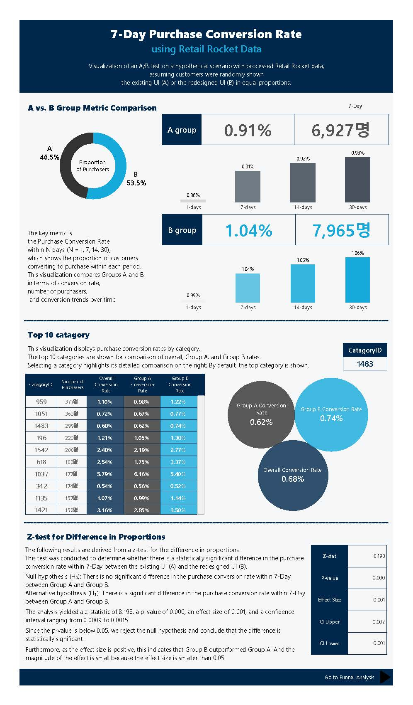

<h1 align="center">Retail Rocket ecommerce ABtest 대시보드</h1>

  
  
  

## 프로젝트 개요
E-commerce 데이터를 활용해 **기존 UI(A)**와 **리메이크된 UI(B)**가 **구매 전환율에 어떤 영향을 미치는지** A/B 테스트 방식으로 검증하였습니다.  
가설검정을 통해 두 UI 중 더 효과적인 방향에 대한 인사이트를 도출하는 것이 본 프로젝트의 목표입니다.  

---

## 프로젝트 주제
- **주제:** 변경된 UI가 구매전환율에 영향을 미치는지 알아보고 어떤 UI가 더 효율적인지 확인해보자
- **기간:** 총 4주  
  - 주제 선정 및 전처리: 1주  
  - 지표 산출: 1주  
  - 가설검정 및 결과 해석: 0.5주  
  - Tableau 대시보드 제작 및 디자인: 1.5주   
- **기여도:** 100% (기획 → 데이터 전처리 → 지표 산출 → 가설검정 → 시각화 전 과정 단독 수행) 

---

## 데이터
- **출처**: [Retail Rocket eCommerce Dataset (Kaggle)](https://www.kaggle.com/datasets/retailrocket/ecommerce-dataset)
해당 데이터셋은 실제로 A/B 테스트 변수를 제공하지 않기 때문에, **고객 ID를 기준으로 A/B 그룹을 무작위로 균등 분할**하여 가상의 실험 환경을 설정했습니다.

- A 그룹: 기존 UI를 본 고객  
- B 그룹: 리메이크된 UI를 본 고객

---

## 프로젝트 아키텍처

1. **데이터 전처리** – 고객 ID별로 무작위로 A/B 그룹을 배정  
2. **지표 설계 및 산출** – 전환율, 경로 비율 등 실험 설계에 맞는 지표 도출  
3. **가설검정 (Z-test)** – 각 지표별로 두 그룹 간 유의미한 차이가 있는지 확인  
4. **시각화 (Tableau)** – 지표와 검정 결과를 바탕으로 3개의 대시보드 제작  

### 📌 참고사항
해당 원본 데이터는 원래 UI 관련 A/B 변수가 존재하지 않습니다.  
본 프로젝트에서는 **가상의 환경**을 설정하기 위해 고객 ID를 기준으로 무작위로 A/B 그룹을 배정하는 방식으로 데이터를 가공하였습니다.  

따라서 본 프로젝트는 실제 실험 데이터가 아닌, **가공된 데이터**를 사용했음을 유의해주시기 바랍니다.

---

## 사용 기술 스택
- **언어**: Python  
- **데이터베이스**: PostgreSQL  
- **시각화 도구**: Tableau  

---

## 주요 특징
- 실제 데이터에 **가상의 A/B 테스트 환경**을 구성해 분석 수행  
- **SQL**로 지표 산출, **Python**으로 가설검정, **Tableau**로 시각화 진행  
- **주요 지표**: N일 이내 구매 전환율 (CTV)  
- **보조 지표**:  
  - Path 전환율 (Direct: view→purchase, ViaCart: view→cart→purchase)  
  - Funnel 전환율 (view→cart, cart→purchase)  
- **대시보드 구성**: 총 3개 페이지 (CTV, Path, Funnel)  

---

## 결과물 확인
- **GitHub 블로그**: [Retail Rocket ABtest 대시보드](https://whitenut200.github.io/prodject/retail%20rocket/RetailRocketABtest-%ED%94%84%EB%A1%9C%EC%A0%9D%ED%8A%B8%EA%B0%9C%EC%9A%94/)
- **Tableau Public**: [Tableau 대시보드](https://public.tableau.com/app/profile/yu.siyeon/viz/ABtestwithRetailRocketdata/CVR)

---
